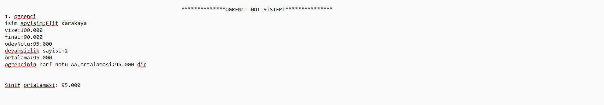

# Öğrenci Karne Sistemi

Bu çalışma, C tabanlı öğrenci karne sistemi projesidir. GitHub Desktop kullanarak projeyi kolayca klonlayabilir, geliştirme yapabilir ve katkıda bulunabilirsiniz.

## 🚀 Başlarken

### 1. Bu projenin çalışması

Bu proje öğretim üyelerine yönelik C programlama dilinde geliştirilmiş metin tabanlı bir uygulamadır. Uygulama aşağıdaki bilgileri kullanıcıdan ister:

* Notu hesaplanacak öğrenci sayısı
* Dersin devamsızlık hakkı sayısı
* Öğrencinin isim ve soyismi
* Öğrencinin vize, final ve ödev notu

Kullanıcının girdiği bu bilgilere göre öğrencinin ders ortalaması, harf notu, dersi geçme durumu ve sınıf ortalaması metin dosyasına yazdırılır. Metin dosyasının görüntüsü aşağıdaki gibidir:



### 2. Bu projeyi kendi bilgisayarınıza klonlayın

GitHub Desktop kullanıyorsanız:

1. "Code" butonuna tıklayın
2. "Open with GitHub Desktop" seçeneğini seçin
3. GitHub Desktop üzerinden dizini seçin ve "Clone" butonuna tıklayın

Alternatif olarak komut satırı ile:

```bash
git clone https://github.com/elif-karakaya/Ogrenci-Karne-Sistemi.git

